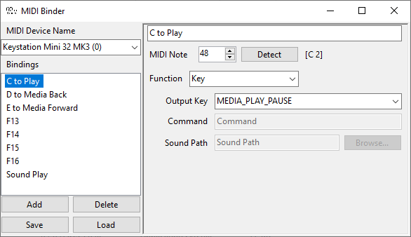

# MIDI Binder
**A way to press keys, run commands and play sounds from your MIDI note-playing device**

## Features
* Press a note on your keyboard to have the corresponding key pressed
* Media keys and other special keys are supported
* Alternatively run a command when a key is pressed
* Play a sound when your note is played, allowing for a MIDI sound board
* Press "Detect" so that your next note press becomes the binding
* Bindings are saved to `bindings.xml` in the same directory, allowing for portability

### Right click on empty space to get the following options:
* Refresh devices
* Minimise to tray (double click icon in taskbar tray to open again)

## Current Limitations
* Only one device can be selected at a time and the bindings are the same for every device
* No auto-save of bindings, ensure you press "Save" before closing to save the bindings to `bindings.xml`
* Only velocities over 50 are counted as presses
* Cannot reorder the bindings in the UI, you will have to modify the `bindings.xml`